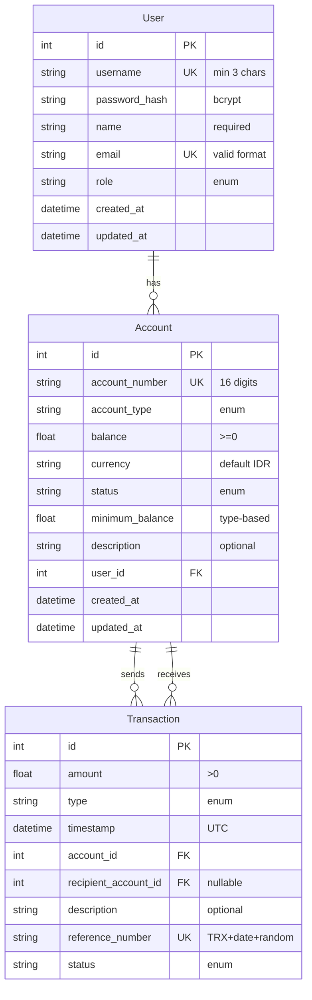

# Database Schema Documentation

## Overview

RevoBank uses SQLite as its database engine with SQLAlchemy as the ORM. The schema is designed to ensure:
- Data integrity through foreign key constraints
- Transaction safety with ACID properties
- Efficient querying with proper indexing
- Audit trail through timestamps

## Entity Relationship Diagram (ERD)

## Table Details

### User

| Column | Type | Constraints | Description |
|--------|------|-------------|-------------|
| id | Integer | PK, Auto-increment | Unique identifier |
| username | String(50) | Unique, Not null | Login username, min 3 chars |
| password_hash | String(128) | Not null | Bcrypt hashed password |
| name | String(100) | Not null | Full name |
| email | String(120) | Unique, Not null | Valid email format |
| role | String(20) | Not null | One of: customer, teller, admin |
| created_at | DateTime | Not null | Record creation time |
| updated_at | DateTime | Not null | Last update time |

Indexes:
- PRIMARY KEY (id)
- UNIQUE INDEX ix_user_username (username)
- UNIQUE INDEX ix_user_email (email)
- INDEX ix_user_role (role)

### Account

| Column | Type | Constraints | Description |
|--------|------|-------------|-------------|
| id | Integer | PK, Auto-increment | Unique identifier |
| account_number | String(16) | Unique, Not null | Type-prefixed number |
| account_type | String(20) | Not null | savings/checking/business/student |
| balance | Float | Not null, >=0 | Current balance |
| currency | String(3) | Not null | Default: IDR |
| status | String(20) | Not null | active/inactive/closed |
| minimum_balance | Float | Not null | Type-based requirement |
| description | String(200) | Nullable | Optional description |
| user_id | Integer | FK(user.id) | Owner reference |
| created_at | DateTime | Not null | Record creation time |
| updated_at | DateTime | Not null | Last update time |

Indexes:
- PRIMARY KEY (id)
- UNIQUE INDEX ix_account_number (account_number)
- INDEX ix_account_user_id (user_id)
- INDEX ix_account_type (account_type)
- INDEX ix_account_status (status)

### Transaction

| Column | Type | Constraints | Description |
|--------|------|-------------|-------------|
| id | Integer | PK, Auto-increment | Unique identifier |
| amount | Float | Not null, >0 | Transaction amount |
| type | String(20) | Not null | deposit/withdraw/transfer |
| timestamp | DateTime | Not null | UTC transaction time |
| account_id | Integer | FK(account.id) | Source account |
| recipient_account_id | Integer | FK(account.id), Nullable | Target account for transfers |
| description | String(200) | Nullable | Transaction details |
| reference_number | String(32) | Unique, Not null | TRX{YYYYMMDD}{8_random} |
| status | String(20) | Not null | completed/pending/failed |

Indexes:
- PRIMARY KEY (id)
- UNIQUE INDEX ix_transaction_reference (reference_number)
- INDEX ix_transaction_account (account_id)
- INDEX ix_transaction_recipient (recipient_account_id)
- INDEX ix_transaction_type (type)
- INDEX ix_transaction_status (status)
- INDEX ix_transaction_timestamp (timestamp)

## Relationships

1. User -> Account (One-to-Many)
   - A user can have multiple accounts
   - Each account belongs to one user
   - Enforced by foreign key user_id in Account table

2. Account -> Transaction (One-to-Many, Bidirectional)
   - An account can have multiple outgoing transactions (account_id)
   - An account can have multiple incoming transactions (recipient_account_id)
   - Each transaction has one source account
   - Each transfer transaction has one recipient account

## Data Integrity

1. Foreign Key Constraints
   - ON DELETE: RESTRICT (prevent deletion of referenced records)
   - ON UPDATE: CASCADE (update references if parent key changes)

2. Check Constraints
   - Account balance >= 0
   - Transaction amount > 0
   - Minimum balance based on account type

3. Status Enums
   - Account: active, inactive, closed
   - Transaction: completed, pending, failed

4. Timestamps
   - All created_at/updated_at fields use UTC
   - Transaction timestamps use UTC

## Performance Considerations

1. Indexing Strategy
   - Primary keys: clustered indexes
   - Foreign keys: non-clustered indexes
   - Frequently queried columns: non-clustered indexes
   - Status and type columns: filtered indexes

2. Query Optimization
   - Use of compound indexes for common query patterns
   - Covering indexes for high-volume queries
   - Filtered indexes for status-based queries

3. Concurrency Control
   - Row-level locking for transactions
   - Optimistic concurrency for account updates
   - Deadlock prevention through consistent lock ordering
